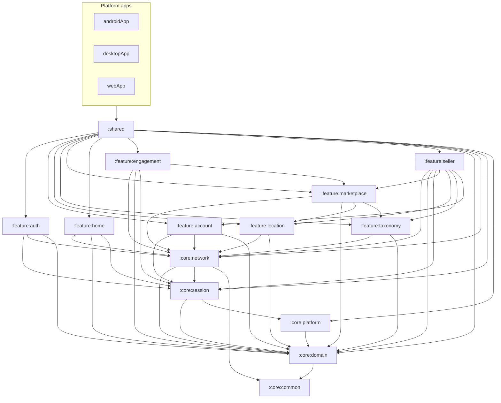

# Dependency Rules

Rules for Gradle modules and Kotlin packages in VitranShop. Phase 1 enforces a small core layer under `:shared`; feature modules arrive incrementally.

## Module dependency graph (Phase 7)



Future modules (Phase 8+):

```text
:feature:seller (products)  → Phase 8 ✅
subscription/payments/referrals → Phase 9 ✅ (packages under :feature:seller)
admin plans                 → Phase 11
```

`:feature:engagement` → `:feature:marketplace` is **one-way** (IDs + `CursorListController`). Marketplace must not depend on engagement.
`:feature:seller` → `:feature:marketplace` is **one-way** (`ShopId`/`ShopSlug` + public cache invalidator). Marketplace must not depend on seller.

Reference modules must **not** depend on marketplace, seller, home, or engagement features.

## Allowed dependencies

| From | May depend on |
|------|----------------|
| Platform apps (`androidApp`, etc.) | `:shared` |
| `:shared` (presentation) | `:feature:auth`, `:feature:account`, `:feature:location`, `:feature:taxonomy`, `:feature:marketplace`, `:feature:home`, `:feature:engagement`, `:feature:seller`, `:core:domain`, `:core:network`, `:core:session`, `:core:platform`, design tokens, Koin |
| `:feature:marketplace` / `:feature:home` | Own domain, `:core:network`, `:core:domain` (+ home: `:core:session`); marketplace also `:feature:location`, `:feature:taxonomy` |
| `:feature:engagement` | Own domain, `:core:network`, `:core:session`, `:core:domain`, `:core:platform`, `:feature:marketplace` |
| `:feature:seller` | Own domain, `:core:network`, `:core:session`, `:core:domain`, `:core:platform`, `:feature:marketplace`, `:feature:location`, `:feature:taxonomy`, `:feature:account` (create orchestration) |
| `:feature:auth` / `:feature:account` | Own domain, `:core:network`, `:core:session`, `:core:domain` |
| `:feature:location` / `:feature:taxonomy` | Own domain, `:core:network`, `:core:domain` |
| `:core:session` | `:core:domain`, `:core:platform` |
| `:core:platform` | `:core:domain` |
| `:core:domain` | `:core:common` |
| `:core:network` | `:core:common`, `:core:domain`, `:core:session` |

## Forbidden dependencies

### Domain layer

Domain (feature or `:core:domain`) must **not** depend on:

- Compose, ViewModels, UI models
- Ktor, `HttpClient`, JSON DTOs
- Room, SQL, DataStore for tokens
- Koin, Android Context, iOS/UIKit types
- Other features' **implementations**

### Presentation layer

Presentation must **not** depend on:

- `HttpClient`, Ktor response types
- Room DAOs, raw SQL
- JSON DTOs (use domain models / UiState)
- Android `Context`, `Uri`, `File`, `NSURL`
- Direct platform file objects

Do **not** call `koinInject()` from Composables — inject into ViewModels or explicit entry points.

### Core design system

`:core:designsystem` (future) must not depend on any feature module.

## Cross-feature rules

Features must not depend on another feature's ViewModel or repository implementation.

**Session example (required pattern):**

```text
Home ──► SessionReader ◄── Auth
Seller ──► SessionReader (token update after CreateShop)
```

Not:

```text
HomeViewModel ──► AuthViewModel   ❌
```

Seller shop creation may return updated JWT roles via `data.tokens.access_token`. Session mutation is owned by `:core:session`, not the Auth feature's ViewModel.

## Core rules

1. **`core` is not a dumping ground** — only genuinely shared concepts
2. Feature-specific models stay in feature domain packages
3. Never resolve Gradle cycles by moving arbitrary classes into `core`

## Circular dependency prevention

When two features need the same concept:

1. Determine true owner
2. If genuinely shared, extract minimal contract to `:core:domain` or `:core:session`
3. Depend on the contract, not the implementation

Checklist before adding a module dependency:

- [ ] Does this create a cycle?
- [ ] Is the dependency on an interface/contract?
- [ ] Could this type live in feature domain instead of `core`?

## Platform dependency rules

| Capability | Approach |
|------------|----------|
| Secure token storage | `:core:platform` interface; android/ios/jvm actuals |
| File upload (multipart) | Shared upload abstraction; platform converts picker result |
| Share / external URLs | Interface + DI |
| Small URL/path helpers on web | expect/actual if needed |

Never expose Room or Android storage APIs to `commonMain` ViewModels.

## Future feature internal structure

When implementing a feature:

```text
feature/<name>/
├── domain/model, repository, usecase, error
├── data/remote/api, dto, mapper, repository
└── presentation/state, viewmodel, screen, component
```

No `BaseViewModel`, `BaseRepository`, or similar inheritance without proven need.

## Type naming

| Layer | Example |
|-------|---------|
| Transport | `LoginRequestDto`, `ShopListItemDto` |
| Domain | `Shop`, `UserProfile` (no `Dto` suffix) |
| Presentation | `LoginUiState`, `ShopCardUiModel` |

Do not reuse API DTOs in Composables because fields look similar.
