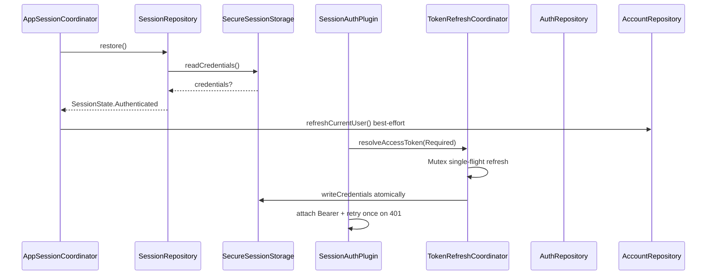
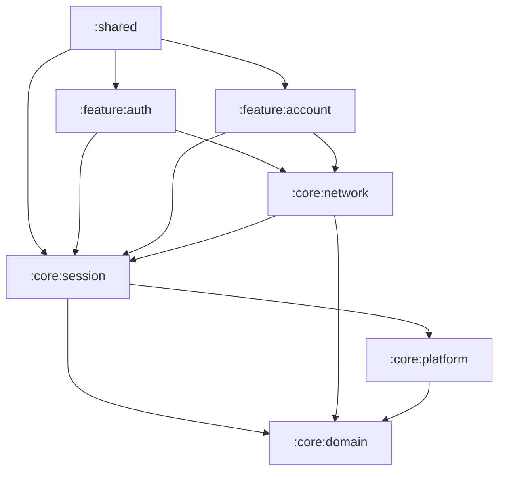
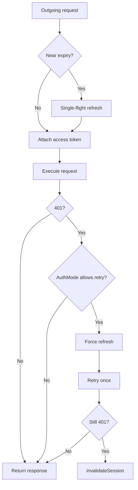

# Session, Authentication & Account (Phase 3)

Production session infrastructure, auth/account feature modules, and app shell wiring. Screens remain in `:shared`; ViewModels and repositories live in `:feature:auth` and `:feature:account`.

## 1. Architecture overview

| Concern | Owner module |
|---------|----------------|
| Credential persistence, refresh, `SessionState` | `:core:session` |
| Secure storage contract + platform impls | `:core:platform` |
| 401 interceptor, token attach, `AuthMode` enforcement | `:core:network` (`SessionAuthPlugin`) |
| Register/login/verify/logout/OTP/password | `:feature:auth` |
| `/auth/me`, profile update, current-user cache | `:feature:account` |
| Verification challenge + password-reset flow state | `:feature:auth` (`AuthFlowStateHolder`) |
| Post-auth account hydration | `:shared` (`AppSessionCoordinator`) |



## 2. Module graph



Gradle cycle between `:core:session` and `:core:network` is avoided: `TokenRefreshRemoteDataSource` interface lives in session; HTTP implementation (`KtorTokenRefreshRemoteDataSource`) lives in network.

## 3. SessionState

```kotlin
sealed interface SessionState {
    data object Restoring : SessionState
    data object Anonymous : SessionState
    data object Authenticated : SessionState
}
```

- **Restoring** — initial state; `SessionRepository.restore()` in progress
- **Anonymous** — no valid credentials (signed out or terminal refresh failure)
- **Authenticated** — in-memory credentials loaded

## 4. SessionRepository

Public contract in `:core:session`. Implementation: `DefaultSessionRepository`.

| API | Behavior |
|-----|----------|
| `restore()` | Read secure storage → populate `CredentialStore` → emit state |
| `establishSession(...)` | Write memory + storage atomically → `Authenticated` |
| `updateAccessToken(...)` | Rotate access token only (Phase 7 seller shop create prep) |
| `logoutLocal()` | Clear storage/memory, notify listeners |
| `invalidateSession()` | Same as terminal auth failure path |

## 5. CredentialStore & SessionReader

- **CredentialStore** — thread-safe in-memory cache; sole source for `SessionReader.accessTokenOrNull()`
- **DefaultSessionReader** — implements existing `SessionReader`; reads credentials + `SessionRoleCache`
- Tokens never exposed to presentation or navigation routes

## 6. SecureSessionStorage (`:core:platform`)

```kotlin
interface SecureSessionStorage {
    suspend fun readCredentials(): StoredSessionCredentials?
    suspend fun writeCredentials(credentials: StoredSessionCredentials)
    suspend fun clearCredentials()
}
```

| Platform | Implementation | Production readiness |
|----------|----------------|----------------------|
| Android | `AndroidSecureSessionStorage` (EncryptedSharedPreferences) | Yes |
| iOS | `IosSecureSessionStorage` (KVault Keychain, ≥1.12.0) | Yes |
| JVM Desktop | `InMemorySecureSessionStorage` | Dev-only fallback |
| JS / Wasm | `InMemorySecureSessionStorage` | No persistent auth — documented gap |

`FakeSecureSessionStorage` in `:core:platform` tests.

## 7. Token expiration policy

- `TokenExpirationPolicy.expirationSkew` ≈ 30 seconds
- `AppClock` / `FakeAppClock` for testable expiry
- Proactive refresh before attach when near expiry

## 8. Token refresh coordinator

`DefaultTokenRefreshCoordinator` (internal):

- **Mutex single-flight** — concurrent callers share one refresh HTTP call
- **Double-check** after lock — skip remote call if another coroutine already refreshed (when `force = false`)
- **Terminal failure** (401/403 on refresh, invalid refresh) → `invalidateSession()`
- **Transient failure** (timeout, 5xx) → preserve credentials, return network error
- **Success** → rotate **both** tokens via `establishSession()` (atomic write)

Refresh HTTP: `KtorTokenRefreshRemoteDataSource` with `AuthMode.None` + `markSkipSessionAuth()`.

## 9. SessionAuthCoordinator

Network integration contract (implemented by `DefaultSessionAuthCoordinator`):

- `resolveAccessToken(authMode)` — fail-fast for `Required` when no session; proactive refresh when near expiry
- `handleUnauthorizedResponse(authMode, retryOnce)` — refresh once, retry original request once; second 401 → invalidate

## 10. SessionAuthPlugin (`:core:network`)

Ktor 3 `createClientPlugin` + `on(Send)` hook:

1. Skip when `SkipSessionAuthKey` set (refresh endpoint)
2. Resolve token via coordinator; attach `Authorization: Bearer`
3. On 401: coordinator refresh + single retry with fresh token
4. `Optional` + POST/PUT/PATCH/DELETE: **no** silent anonymous retry after 401

Installed in `HttpClientFactory` (replaces Phase 2 `AuthHeaderPlugin` for token attach).

## 11. AuthMode matrix

| Mode | Pre-request | 401 retry |
|------|-------------|-----------|
| `None` | No token | No |
| `Optional` | Token if available; refresh if near expiry | GET/HEAD only |
| `Required` | Fail locally if no session; refresh if near expiry | Once after refresh |

## 12. Auth feature (`:feature:auth`)

### Domain

- `VerificationChallenge`, `LoginResult`, `RegisterCommand`, `PasswordResetContext`
- `AuthRepository`, `AuthError` (refines `AppError`)
- Use cases: Register, Login, Verify, ResendOtp, RequestPasswordReset, ResetPassword, Logout

### Data

- `AuthApi` — all auth endpoints with `authMode(None)` except refresh (session-owned)
- `DefaultAuthRepository` — maps DTOs; login 403 + `errorDataJson` → `VerificationRequired`; success → `sessionRepository.establishSession()`
- `AuthFlowStateHolder` — in-memory challenge + reset phone (cleared on logout)

### Phone format

UI: `normalizeIranMobile()` → `09xxxxxxxxx`. API mapper `toApiPhone()` strips leading `0` → `9123456789`. See `docs/api-gaps.md` Gap 8.

## 13. Account feature (`:feature:account`)

- `User`, `CurrentUserState`, `AccountRepository`
- `AccountApi`: `GET /auth/me`, `PUT /auth/profile` with `AuthMode.Required`
- `DefaultAccountRepository` — `StateFlow` cache; updates on profile PUT; listens to session invalidation
- `UserRole.fromBackend()` with `Unknown(rawValue)` — never crash on new roles

## 14. App shell wiring

### DI (`VitranKoin.kt`)

```kotlin
modules(
    appModule(apiEnvironment),
    platformModule(),
    sessionModule,
    networkModule,
    authModule,
    accountModule,
    appCoordinatorModule,
)
```

### AppSessionCoordinator

- Startup: `sessionRepository.restore()`
- `Authenticated` → best-effort `accountRepository.refreshCurrentUser()` (failures do **not** logout)
- `Anonymous` → `accountRepository.clear()` + `authFlowStateHolder.clear()`

### Screens wired to ViewModels

| Screen | ViewModel | Runtime mock removed |
|--------|-----------|------------------------|
| LoginScreen | `LoginViewModel` | Yes |
| RegisterScreen | `RegisterViewModel` | Yes |
| RegisterVerifyScreen | `RegisterVerifyViewModel` | Yes (OTP from flow holder) |
| ForgotPasswordScreen | `ForgotPasswordViewModel` | Yes |
| ResetPasswordScreen | `ResetPasswordViewModel` | Yes |
| ProfileScreen | `ProfileViewModel` | Yes |
| AccountScreen | `AccountRepository` observe | Identity row (hub extras still mock) |

Sign-out: `LogoutUseCase` in `AppNavHost` → navigate to login.

## 15. Auth workflows

### Register + verify

1. `POST /auth/register` → `VerificationChallenge` stored in `AuthFlowStateHolder`
2. Navigate to verify (phone in route only — **never** tempToken in URL)
3. `POST /auth/verify` → `establishSession()` → home

### Login with verification required

1. `POST /auth/login` → 403 with `temp_token` in error data
2. `LoginResult.VerificationRequired` → verify screen
3. Same verify flow as registration

### Password reset

1. `POST /auth/forgot-password` → reset context in flow holder
2. `POST /auth/reset-password` → success navigates to login (**no** auto-auth)

### Logout

1. `POST /auth/logout` with refresh token (best-effort)
2. Always `logoutLocal()` even if network fails

## 16. Refresh flow



## 17. Security rules

- No tokens/tempToken/OTP in ViewModel state exposed to UI persistence
- `LoggingSanitizer` redacts auth fields
- Transient refresh errors do **not** clear credentials
- JWT claims are **not** decoded for roles — roles from `/auth/me` only

## 18. Testing

| Module | Key tests |
|--------|-----------|
| `:core:session` | Restore, refresh rotation, concurrent single-flight, terminal vs transient |
| `:core:network` | AuthMode fail-fast, 401 retry, Optional POST no-retry |
| `:feature:auth` | Login success, verification-required, logout clears local |
| `:feature:account` | Unknown roles, profile cache update |

Run: `./gradlew :core:session:jvmTest :core:network:jvmTest :feature:auth:jvmTest :feature:account:jvmTest`

## 19. Known gaps

See `docs/api-gaps.md`: phone format, username/email nullability, Web/Desktop persistent storage, profile PUT partial semantics.

## 20. Phase 4 readiness

- Session + auth + account foundation complete for marketplace features
- `SessionReader.roles` populated after `/auth/me`
- Home/Categories can adopt `AuthMode.Optional` endpoints
- Seller flows can call `updateAccessToken` after shop create when backend returns new JWT

---

Related: [ADR 0005](decisions/0005-session-and-token-lifecycle.md), [networking.md](networking.md), [dependency-rules.md](dependency-rules.md).
